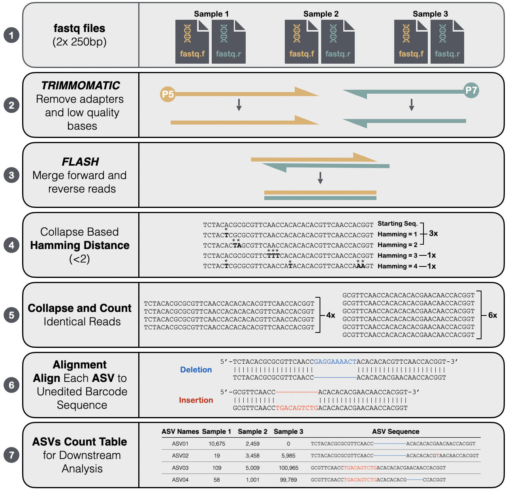

EvoTraceR
================

[](https://github.com/Nowak-Lab/EvoTraceR/actions?query=workflow%3Acheck-master)
[](https://github.com/Nowak-Lab/EvoTraceR/actions?query=workflow%3Acheck-development)

*EvoTraceR* is an R package to analyse sequencing amplicon data from CRISPR-Cas9 recorder lineage tracing experiments. The package takes in paired-end FASTQ files from one to many tissues. The sequenced amplicon can contain one to many Cas9 cut sites. *EvoTraceR* trims and merges reads, collapses duplicates, calls mutations and infers a tree using [Cassiopeia](https://github.com/YosefLab/Cassiopeia). The package outputs the inferred tree of relationships between Amplicon Sequence Variants (ASVs) as well as summary plots and tables of mutations.




Installation
--------------

```
library(devtools)
install_github("Nowak-Lab/EvoTraceR")
```

*EvoTraceR* can also be installed with the above method in a `conda` environment. Based on our experience, a clean environment installed with `r-base` and `r-essentials` from the `conda-forge` channel works well.

Dependencies
--------------

* [flash](https://ccb.jhu.edu/software/FLASH/)
* [trimmomatic](http://www.usadellab.org/cms/?page=trimmomatic)

Binaries for these dependencies can be downloaded via the links above. All other dependencies are handled by `devtools` during the package installation.


Usage example
--------------

An empirical toy dataset is available to test *EvoTraceR*. The sequences were generated from a single mouse `MMUS1495` and taken from cancer populations in four tissues (labelled `PRL`,`RBL`,`LVR`,`LVM`). The CRISPR-Cas9 recorder design was designated `BC10v0`. The naming scheme for the FASTQ files was thus `MMUS1469_PRL_BC10v0_MG_120419`. Note that *EvoTraceR* expects similar input file names with tissue labels in the same position of the naming scheme.

To get started with the analysis, we provide the directory containing the input FASTQ files. We also provide an output directory and the paths to the `trimmomatic` and `flash` binaries on our system (adjust these paths as needed for your system). Then we preprocess our input data with the `initialize_EvoTraceR` function.

```
library(EvoTraceR)
input_dir <- system.file("extdata", "input", package = "EvoTraceR")
output_dir <- "example_output"
trimmomatic_path <- "/my/path/trimmomatic.jar"
flash_path <- "/my/path/flash"

EvoTraceR_object <-
  initialize_EvoTraceR(
    input_dir = input_dir,
    output_dir = output_dir,
    map_file_sample = NULL,
    trimmomatic_path = trimmomatic_path,
    flash_path = flash_path)

```

Now that the FASTQ data has been cleaned and the paired reads merged, we align the merged reads to the reference and call indels. To do this, we use the `asv_analysis` function and provide our unedited template sequence as the `ref_seq` and the expected flanking sequences. We also provide the 1-based reference sequence coordinates of the expected Cas9 cut sites and the borders between individual target regions. This information is used to filter sequences with unexpected mutation patterns. For additional options on alignment parameters, parallelization and more, see the documentation.

```
EvoTraceR_object <-
  asv_analysis(EvoTraceR_object = EvoTraceR_object,
               ref_name = "BC10v0",
               ref_seq = "TCTACACGCGCGTTCAACCGAGGAAAACTACACACACGTTCAACCACGGTTTTTTACACACGCATTCAACCACGGACTGCTACACACGCACTCAACCGTGGATATTTACATACTCGTTCAACCGTGGATTGTTACACCCGCGTTCAACCAGGGTCAGATACACCCACGTTCAACCGTGGTACTATACTCGGGCATTCAACCGCGGCTTTCTGCACACGCCTACAACCGCGGAACTATACACGTGCATTCACCCGTGGATC",
               ref_flank_left = "^TCTAC",
               ref_flank_right = "CCCGTGGATC$",
               ref_cut_sites = c(17, 43, 69, 95, 121, 147, 173, 199, 225, 251), # cut sites for Cas9 based on "ref_seq"
               ref_border_sites = c(1, 26, 52, 78, 104, 130, 156, 182, 208, 234) # border for marking site (guide=20, PAM=3, spacer=3) = 26 x bp
               )
```

Finally, we process the mutations, infer a tree and output summaries of the results.

```
EvoTraceR_object <-
  analyse_mutations(EvoTraceR_object = EvoTraceR_object)

EvoTraceR_object <-
  infer_phylogeny(EvoTraceR_object = EvoTraceR_object, mutations_use = "del_ins")

EvoTraceR_object <-
  create_df_summary(EvoTraceR_object)
```

Output files
--------------

After running the example analysis, the following output files will be generated.

```
example_output/
|-- asv_analysis
|   |-- asv_filtering_freq.pdf
|   `-- asv_length_freq.pdf
|-- fastq_analysis
|   |-- fastq_flash_merged
|   |-- fastq_summary.csv
|   `-- fastq_trimmed
`-- phylogeny_analysis
    `-- phylogeny_del_ins
        |-- asv_stat.csv
        |-- tree_all_clones.csv
        `-- tree_all_clones.newick
```

The two key files for most follow-up analyses are as follows.

* `asv_stat.csv`: Summary of all of detected amplicon sequence variants (ASVs) and mutations in the input FASTQ files
* `tree_all_clones.newick`: Tree of the phylogenetic relationships between ASVs based on the detected mutations


Contact
--------------

Please feel free to contact us with feedback: Dawid Nowak, dgn2001 at med.cornell.edu or Armin Scheben, ascheben at cshl.edu.
